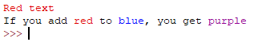
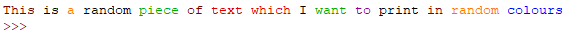
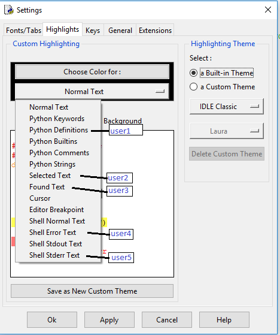
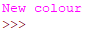

# idlecolors

Print in colour in IDLE.

_These functions will ONLY work in IDLE, they use a side effect of the IDLE syntax highlighting. Only use idlecolors for fun. To use colours properly in a terminal please use [colorama](https://github.com/tartley/colorama) or [crayons](https://github.com/kennethreitz/crayons)_

## How do I install idlecolors

Download the file `idlecolors.py` and save it onto your computer.

## How do I use colours
Create a Python program in the same folder as the `idlecolors.py` file and add the following statement once at the start of your program:

```python
from idlecolors import *
```

Then, you can use the `printc()` function along with the colour functions:

```python
printc( red("Red text") )
printc( "If you add " + red("red") + " to " + blue("blue") + ", you get " + purple("purple") )
```



You can also randomly select colours like this:

```python
# Print a line in a random colour
printc( randcol("This is a random colour") )
```


By default, the `printc()` function adds a newline character at the end of its output, just like `print()`. You can change the end character in
the same way as you would with the print function by specifying an `end` argument as in the example below.

```python
# Print each word in a random colour
mytext = "This is a random piece of text which I want to print in random colours"
mytext = mytext.split(" ")
for word in mytext:
    printc(randcol(word), end=" ")
```



## What colours are available?

You can use the colours `red()`, `orange()`, `green()`, `blue()`, `purple()`, `black()`, `brown()` and `randcol()` for a random colour from this selection.

These colours are defined by the default syntax highlighting in IDLE (Options > Configure IDLE). If you have changed IDLE's colour scheme, the colours will not match!

## Can I add more colours?

Yes, but it is not particularly straightforward and involves some configuration. You can define 5 custom user colours manually:

1. In IDLE, select `Options` > `Configure IDLE`, then click on the `Highlighting` tab.
1. Click the drop down `Normal text` and select a settings to change. In this example we will choose Python Definitions which is known as the colour `user1()`.

  

1. Select a new colour by clicking on the "Choose colour for" button and selecting a colour

  

1. Open the `idlecolors.py` file and change the `USE_CUSTOM_COLORS` value to `True`. (Be aware that this will also allow **all** of the user defined colours to be randomly chosen.)

```python
USE_CUSTOM_COLORS = True       # Change to True if you want to use custom colours
```

1. You can now use the colour you selected as `user1()`.

  ```Python
  from idlecolors import *
  printc( user1("New colour"))
  ```

  

If you wish, you can change the name of the colour by editing the `idlecolors.py` file - you will need to edit both the `colormap` key and the function name.

## Isn't this a really nasty hack?

Yes, yes it is.

### Thanks

Credit for this idea came from this [Stackoverflow thread](https://stackoverflow.com/questions/42472958/how-do-i-print-colored-text-in-idles-terminal)
